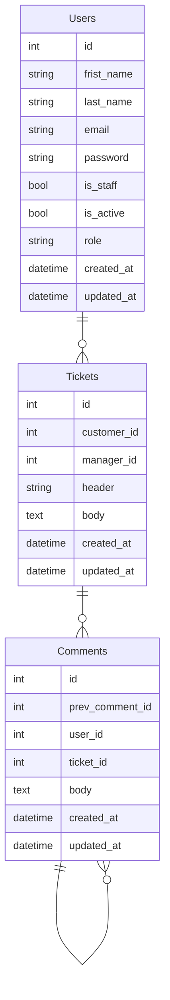

# <span style="color:OliveDrab">Support service application</span>


## <span style="color:DarkOliveGreen">Adjust the application</span>

### Create '.env' file based on '.env.default'
```bash
cp .env.default .env
```


### Install deps
```bash
pipenv sync --dev

# Activate the environment
pipenv shell
```

- ### Frameworks:
    - Django
    - Django REST framework    

- ### Libraries:
    - pydantic
    - requests
    - djangorestframework-simplejwt
    - psycopg2-binary
    - django-stubs
    - djangorestframework-stubs

## <span style="color:DarkOliveGreen">Code quality tools</span>

- ### Linter:
    - flake8
- ### Code formatters:
    - black
    - isort
- ### Type checker:
    - mypy


## <span style="color:DarkOliveGreen">Application description</span>

```bash
▾ users
    ├─ apps.py # Django apps configuration
    ├─ urls.py # pre-controller
    ├─ api.py # Endopints / post-controller
    ├─ models.py # Database tables mapper
    ├─ admin.py # Database tables mapper
    # └─ api.py # Endopints / post-controller
```


# Database

