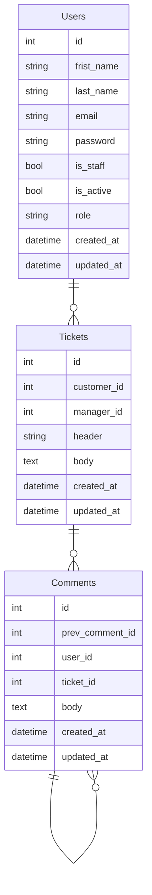

# <span style="color:OliveDrab">Support service application</span>


## <span style="color:DarkOliveGreen">Adjust the application</span>

### Create '.env' file based on '.env.default'
```bash
cp .env.default .env
```


### Install deps
```bash
pipenv sync --dev

# Activate the environment
pipenv shell
```


### Collect static files
```bash
python src/manage.py collectstatic
```


## Run using Docker Compose
```bash
docker-compose up -d
```


### Useful commands
```bash
# Build images
docker-compose build

# Stop containers
docker-compose down

# Restart containers
docker-compose restart

# Check containers status
docker-compose ps


## Logs

# get all logs
docker-compose logs

# get specific logs
docker-compose logs app

# get limited logs
docker-compose logs --tail 10 app

# get flowed logs
docker-compose logs -f app
```


==================================================

==================================================
# <span style="color:DarkOliveGreen">Starting the support server</span>

### 1️⃣  Launch and connect to a virtual server
▶️ First, you need to run a virtual server (for example, we deploy a web server on AWS based on the <span style="color:green">Ubuntu</span> operating system). The launch documentation can be found here:
- [Amazon Elastic Compute Cloud (Amazon EC2) documentation](https://docs.aws.amazon.com/ec2/index.html?nc2=h_ql_doc_ec2)
  
☑️ Upon registration, you will receive a <span style="color:green">.ppk</span> key on your local device. 
To configure the connection to the web server, use the appropriate client program for working with network protocols (for example, PuTTY for Windows or other).

### 2️⃣ Update the installed packages in your system, install Docker and docker-compose
🟧  Using the web server terminal, enter the following commands:
```bash
# 1) update apt
sudo apt update -y && sudo apt upgrade -y

# 2) install a few necessary packages that allow apt to use packets over HTTPS
sudo apt install apt-transport-https ca-certificates curl software-properties-common -y

# 3) add the GPG key for the official Docker repository to your system
curl -fsSL https://download.docker.com/linux/ubuntu/gpg | sudo apt-key add -

# 4) add the Docker repository to the APT sources
sudo add-apt-repository "deb [arch=amd64] https://download.docker.com/linux/ubuntu focal stable"

# 5) update the package database and add Docker packages from the newly added repository to it
sudo apt update -y

# 6) install Docker
sudo apt install docker-ce -y

# 7) install docker-compose
sudo apt install docker-compose -y
```

### 3️⃣ Setting up an SSH connection between the server and GitHub, clone the project
🟨  Continue working in the web server terminal:
```bash
# 1) go to the .ssh
cd .ssh

# 2) generate a new pair of keys
ssh-keygen -t rsa -b 4096

# 3) read the public SSH key (for example, with the name id_rsa.pub)
cat id_rsa.pub

#    copy the key and paste it to the list of SSH keys associated with your GitHub account

# 4) clone the project (for example, git@github.com:Julia-Shejko/support_service.git) from GitHub to the server
git clone git@github.com:Julia-Shejko/support_service.git
```

### 4️⃣ Set the support server settings
🟩  Still work in the web server terminal:
```bash
# 1) go to the support_service directory
cd support_service

# 2) create '.env' file based on '.env.default'
cp .env.default .env

# 3) open and edit the .env file using the nano editor
nano .env

#    add a new value (if necessary) for the variables, 
#    press ctrl+O to overwrite the file, ctrl+X to exit

# 4) open and edit the docker-compose.yml file using the nano editor
nano docker-compose.yml

#    remove ports in "postgres" service: delete value    
#      ports:
#        - "5432:5432" 
#    press ctrl+O to overwrite the file, ctrl+X to exit
```

### 5️⃣ Start the server
🟪  You will continue to work in the terminal:
```bash
# 1) build images
sudo docker-compose build

# 2) run using Docker Compose
sudo docker-compose up -d

# 3) collect static files
sudo docker-compose exec app python src/manage.py collectstatic

# 4) make migrations
sudo docker-compose exec app python src/manage.py migrate

# 5) create superuser 
sudo docker-compose exec app python src/manage.py createsuperuser
```

☑️ Go to the browser, enter 

### IP address:8000

and check the connection

==================================================

==================================================


- ## Frameworks:
    - Django
    - Django REST framework    

- ## Libraries:
    - pydantic
    - requests
    - djangorestframework-simplejwt
    - psycopg2-binary
    - django-stubs
    - djangorestframework-stubs
    - gunicorn

## <span style="color:DarkOliveGreen">Code quality tools</span>
- ### Validation with CircleCI

- ### Linter:
    - flake8
- ### Code formatters:
    - black
    - isort
- ### Type checker:
    - mypy


## <span style="color:DarkOliveGreen">Application description</span>

# Database


